# a webhook delivery system for payment merchant endpoints

A Go service that delivers payment webhooks to 1,142 merchant endpoints, keeping events for the same resource in order. It was tested against a simulated receiver with six merchant types and replayed traffic: at 200 events/s every one of 33,522 deliveries arrived; at 3,000 events/s, 99.9% of 666,302 arrived with 0 ordering violations, using about 1.35 cores of an 8-core laptop.

## requirements

- ordering of resources is prioritised
- can handle 200 events/sec on a normal day, and 3000 events/sec on the busiest days
- typically handles about 1000+ endpoints
- promises to deliver each event at least once
- poor performance of 1 endpoint shouldn't affect the rest

is able to serve 6 different types of merchants:

1. Merchant order backends
2. On-prem ERP connectors
3. Fraud scoring vendor
4. Internal analytics pipeline
5. Small merchants on shared hosting
6. Ops notifiers

## Assumptions

- events are received via an internal channel
- rate and concurrency limits for endpoints are unknown at registration

## results

| | Normal day | Busiest day |
|---|---|---|
| Incoming rate | 200 events/s for 75 s | 3,000 events/s for 100 s |
| Events → deliveries | 15,000 → 33,522 | 300,000 → 666,302 |
| Delivered | 33,522 | 665,734 |
| Dead-lettered (all 6 attempts failed) | 0 | 30 (shared hosting, random 500s) |
| Refused at admission | 0 | 538: 483 fraud vendor during lane resizes in the first 6 s; 55 analytics (9 at a resize, 46 after a ~150 ms process stall at t+33 s) |
| Analytics pipeline (must never lose an event) | 15,000 / 15,000 | 299,945 / 300,000 |
| Ordering violations (same resource, same endpoint) | 0 of 12,224 pairs | 0 of 243,227 pairs |
| Retries · early · duplicates | 1,039 · 0 · 0 | 22,956 · 0 · 0 |
| p99 first attempt, all except ERPs | 0.88 s | 0.89 s (events after the first 6 s) |
| p99 first attempt: merchants · fraud vendor · analytics | 1.7 ms · 1.6 s · 0.17 s | 0.09 s · 2.0 s · 0.12 s (after the first 6 s) |
| Lanes reached: analytics · fraud vendor | 40 · 80 | 500 · 500 |
| Goroutines (peak) | 9,545 | 14,053 |
| Memory (peak, Sys) | 270 MB | 589 MB |
| CPU while sending (8-core laptop, CPU profile) | 0.51 cores | 1.35 cores (0.98–1.86 across three runs of the same rate) |

The ERP connectors take 5 s per request and allow 2 at a time (0.4 deliveries/s each), so their backlog can't meet a 2 s target at either rate: p99 20.2 s on a normal day, and on the busiest day their queue takes ~18 minutes to drain. They don't slow anyone else down.

Full reports: refer to run 60 (normal day) and run 61 (busiest day)

requirements are mostly met, and will be even more mostly met once i add the database.
the pending issues that i will handle are:

- what i will do with the parked deliveries
- more granular error handling
- more rigorous retrying over long time periods
- handling abandoned endpoints

## now for the system description

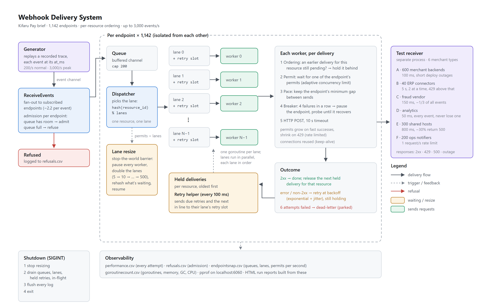

i think the best way to describe how it works is to follow the journey of an event through the system.
all events are received via an events channel, into receiveevents function. this function
then sends it to its endpoint queue if the queue isn't full, and returns a response via a response channel.

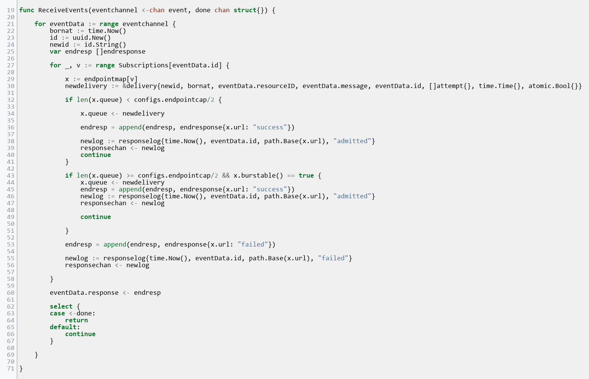

from the endpoint queues we go to the lanework function where events, now called deliveries,
are distributed to the available lanes in their respective endpoint, by resource id, to preserve ordering.
each lane is also given a second channel for retries (laneresource), and handed a goroutine to send its deliveries.

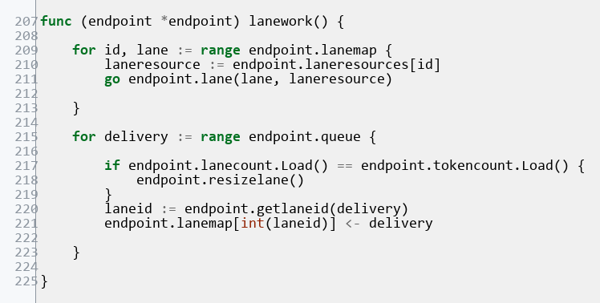

we go to the lane goroutine, which selects over the main lane, the retry lane, and a waker for when we are adding lanes to the endpoint.
if the delivery shares the same resource id with another awaiting a retry, it is held back.
then we add a counter for deliveries that are in transit and give each a token.
tokens is how we control the number of deliveries that could be in flight for a single endpoint (concurrency limit).

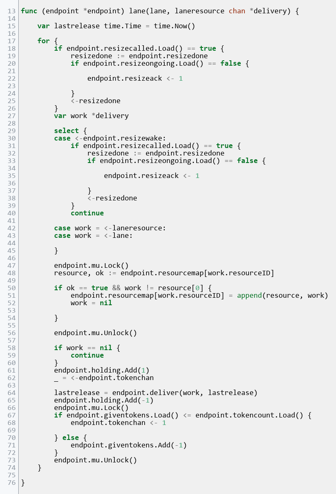

after giving a token, we attempt to send the delivery in the deliver function.
the first part of deliver tries to adhere to whatever is currently set as the rate between sends per lane and wait out any extra time (ignore lanehold for now).
then it sets up the payload, and attempts a post to the endpoint url. we keep some info about the last 10 delivery attempts in the endpoint (history).
if the delivery was successful, we try to increase the rate and concurrency with checkpace.

<details>
<summary><b>checkpace details</b></summary>

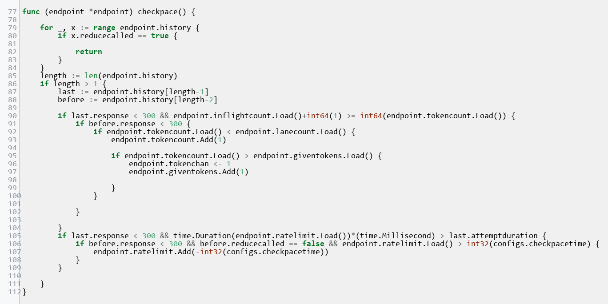

first, if the history contains any attempt to reduce the pace, we return. we check the last 2 responses were successful and the inflight count has maxed out to the allowable concurrency limit, then we increase.
it also checks if the time for the last attempt was less than the current rate limit, then we reduce the rate limit, up to a configured minimum.

</details>

if the result was a 429, we try to reduce the pace using function reducepace.

<details>
<summary><b>reducepace details</b></summary>

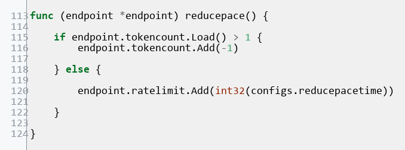

first it reduces the concurrency limit by 1; if it is at 1, then adds to the rate limit by a configured duration.

</details>

if the result wasn't successful, a counter for consecutive failures is incremented. the delivery is added to a map by resource id, and given a retry time using the backoff function.

<details>
<summary><b>backoff details</b></summary>

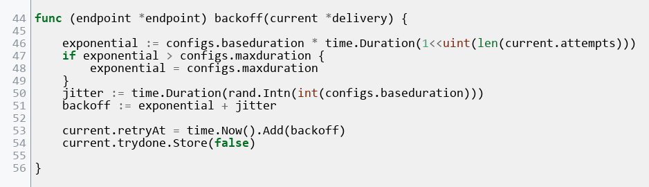

</details>

if consecutive failures reaches a set amount, then the endpoint holds all deliveries and sends a health probe. this is achieved with the lanehold function.

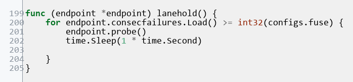

it calls the probe every second as long as the consecutive failures are at or beyond the allowed limit.

<details>
<summary><b>probe details</b></summary>

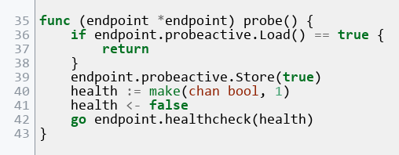

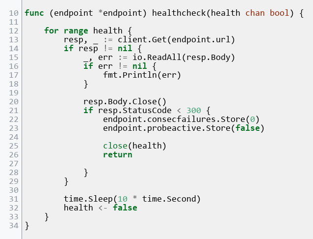

flags itself as active and makes a request to the affected endpoint's url.

</details>

if the delivery has used up all its attempts, it is parked and its resource-related deliveries still proceed.

for retries, we have the retrywork function. it uses getresources function to send all deliveries in the retry map which are due, to their respective retry lanes. this function is affected during lane resizing, so we have some logic to ensure it is in an idle state at resize.

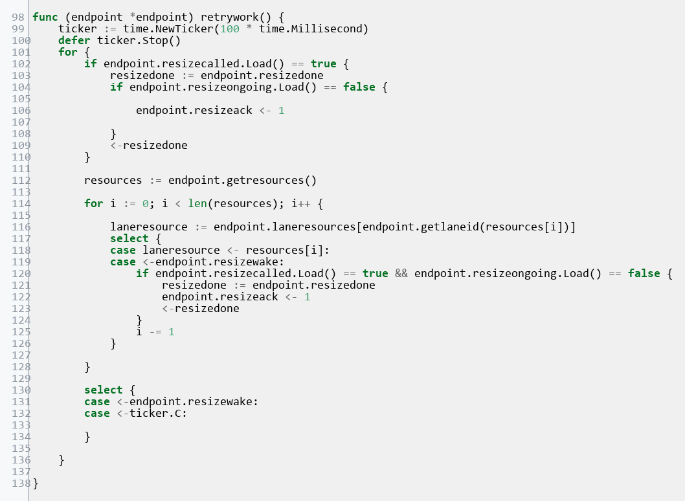

<details>
<summary><b>getresources details</b></summary>

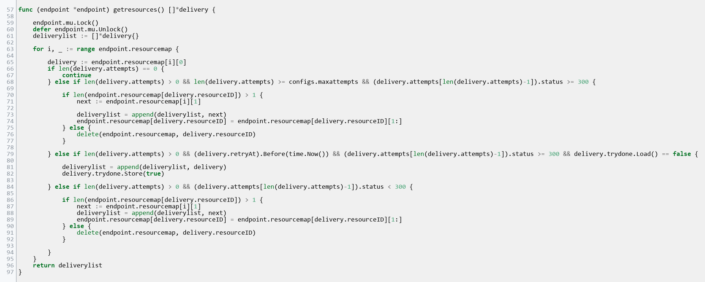

</details>

in the beginning of this project,
i had started with the customer registering their rate and concurrency limits for each endpoint, but i reasoned that this method was too reliant on the client to keep their endpoint at that pace.

all endpoints are identical at the start, and find their way to a stable rate and concurrency. that means they all start with the same number of lanes (5 at the time of writing this). this means that the concurrency limit is capped at 5.
some endpoints will be ok with that, but some have large amounts of traffic,
with receiver concurrency in the hundreds. the intuitive move for me was to increase the number of lanes for each endpoint and give permits according to each endpoint's demands,
but i started approaching the limits of this approach when i scaled testing to the 1000+ endpoints. even at slow rates, total goroutine count was up to 49,749 goroutines for 40 lanes per endpoint, yet the fraud vendor still tops out near 267/s (refer to run 48).

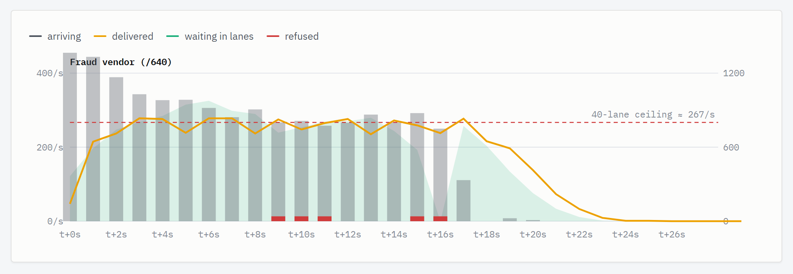
*Run 48, 750 events/s with 40 fixed lanes per endpoint: the fraud vendor tops out near 267 deliveries/s and starts refusing.*

resizelane function increases the number of lanes for a certain endpoint by doubling the number,
up to a configured maximum. this was a challenge, because a lot of work happens around the lanes,
ordering had to be preserved, no delivery lost, and the number of lanes was one of the variables used to hash deliveries
with same resource id to their lane.

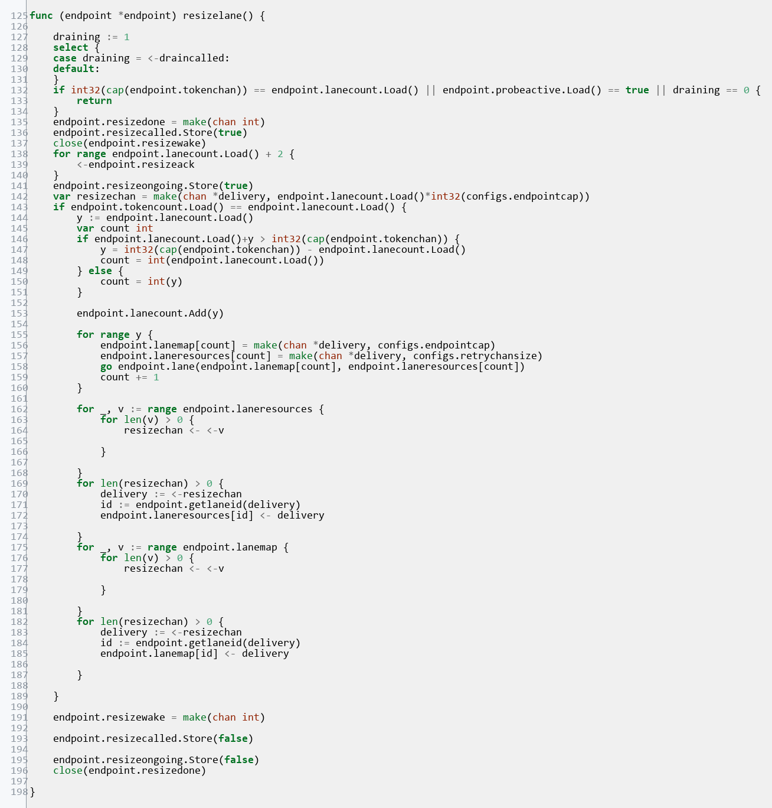

first we set a boolean to inform everyone involved that resize has begun and add a wake for sleeping and waiting functions, then we wait for everyone to acknowledge. this enables us to only proceed when we know everyone is in idle state.
then we create new lanes, and increase the lanecount. after creating the new lanes, every waiting delivery is rehashed into its new lane to preserve order. we then close a channel to inform that the resize is done. i can say i ran into some issues with this one, where new lanes would try to participate in the resize, and i hadn't accounted for the logger sleep, so it had to wait for the 1 second before it acknowledged (run 49), etc.

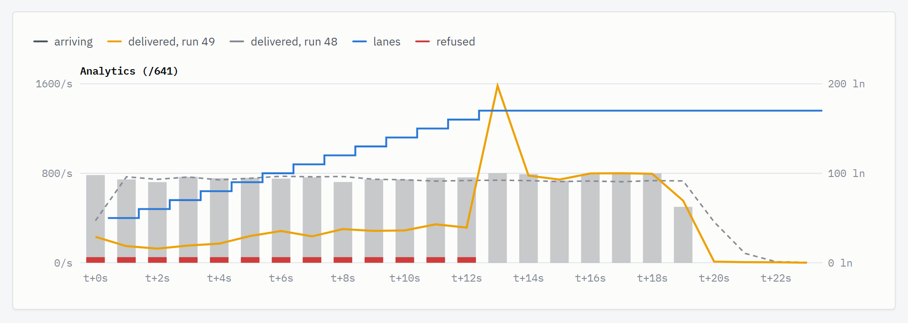
*Run 49 (at the time: 40 starting lanes, +10 per resize): lanes grow exactly once per second (the logger's sleep), and analytics delivers under half of run 48's rate while refusing 5,807.*

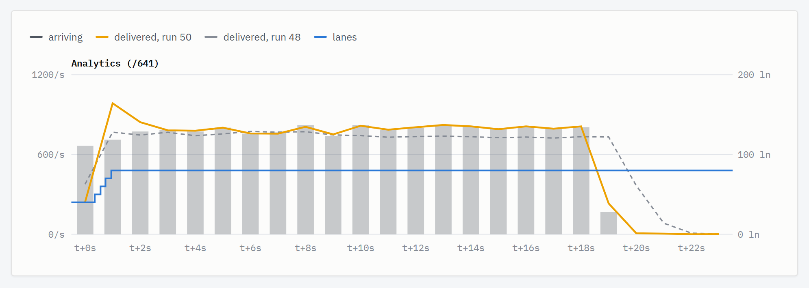
*Run 50 (same setup as run 49): the logger wakes on the resize signal, pauses drop to one request, nothing is refused.*

having the freedom to reduce each endpoint's lanes to 5 reduced the number of goroutines by 81% (run 51).

| | Run 50 · start 40 lanes | Run 51 · start 5 lanes |
|---|---|---|
| Goroutines (median) | 49,368 | 9,482 |
| Memory peak (Sys) | 912 MB | 274 MB |
| Delivered | 33,520 + 2 dead-lettered | 33,522 |

this function is useful for the analytics and fraud vendor endpoints, whose traffic is large. however, the resize temporarily halts the delivery process, and testing against the 3000/s rate shows the endpoint fills in a short time.

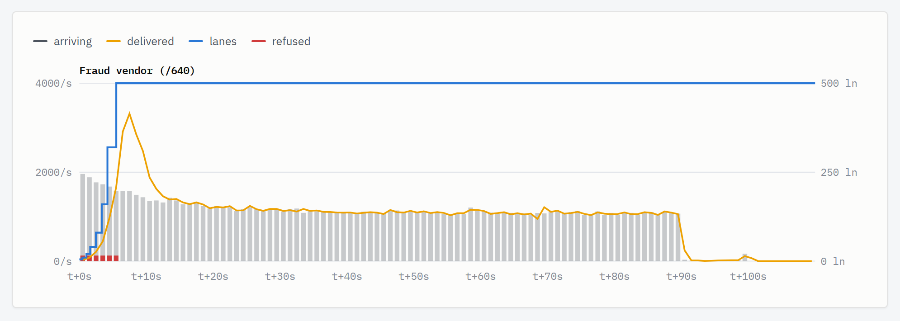
*Run 61, 3,000 events/s: the fraud vendor doubles 5 → 500 lanes in seven steps by t+5.5 s. Each red mark is a resize pause filling the 200-slot queue: 483 refused in total, none after t+5.5 s. With +10 lanes per step instead of doubling (run 57) it took 19 s and refused 1,604.*

however, this does not undermine the benefit, since starting everyone on a high number of lanes creates a lot of unused goroutines.
ultimately, once i start the next phase of this project i'll probably send the overflow to a database to ensure no deliveries are lost.


## performance

to test the system i created a test receiver to simulate the six customer profiles, with some outages and errors:

| Profile | Endpoints | Response time | Concurrent requests allowed | Behaviour |
|---|---|---|---|---|
| 1. Merchant order backends | 600 | 100 ms | 10 | 1% random 500s; endpoint `/0` has scheduled outages (60–150 s and 270–300 s) |
| 2. On-prem ERP connectors | 40 | 5 s | 2 | 429 above 2 concurrent; 1% random 500s |
| 3. Fraud scoring vendor | 1 | 150 ms | 500 | 429 above 500 concurrent; 1% random 500s |
| 4. Internal analytics pipeline | 1 | 50 ms | 1,000 | 1% random 500s |
| 5. Small merchants on shared hosting | 300 | 800 ms | 3 | 429 above 3 concurrent; 30% random 500s |
| 6. Ops notifiers | 200 | 50 ms | 1 | 1 request per second per endpoint, 429 above that |

and distributed the 1000+ endpoints to them as per their typical ratios.

| Profile | Endpoints | Share of deliveries (busiest-day trace) |
|---|---|---|
| Merchant order backends | 600 | 31.5% |
| On-prem ERP connectors | 40 | 2.2% |
| Fraud scoring vendor | 1 | 16.1% |
| Internal analytics pipeline | 1 | 45.0% |
| Small merchants on shared hosting | 300 | 4.5% |
| Ops notifiers | 200 | 0.7% |
| **Total** | **1,142** | **666,302 deliveries from 300,000 events** |

for event generation, the test events come from a seeded trace generator script that models the six merchant classes and event lifecycles and are written to a csv, each at a specified rate for tests. the generator script was written by claude. i read them and send to events channel in generator.go.
the system also records some relevant metrics for analysis, an endpoint logger, something for goroutines, cpu and memory, and another for rejected events. they are logged to csv files. for each run, i task claude to generate a report based on the 4 logged csvs, and for the last runs, a cpu pprof, in docs/runs/ folder. all in all i have run about 59 test runs, suffice to say that the design at the beginning is different from what it is now.

the system performs great at the normal incoming rate:

- 33,522 deliveries from 15,000 events, all delivered: 0 refused, 0 dead-lettered, 0 ordering violations
- p99 first attempt 0.88 s for everything except the ERPs; merchants 1.7 ms, analytics 0.17 s, fraud vendor 1.6 s (its slow ones all in the first 5 s, while its lanes grew 5 → 80)
- endpoint `/0` went down mid-run: the circuit breaker paused it for 91 s, held 5 deliveries, and delivered all 5 in order after it recovered
- about 0.5 of a CPU core (profiled), 270 MB of memory, 9,500 goroutines

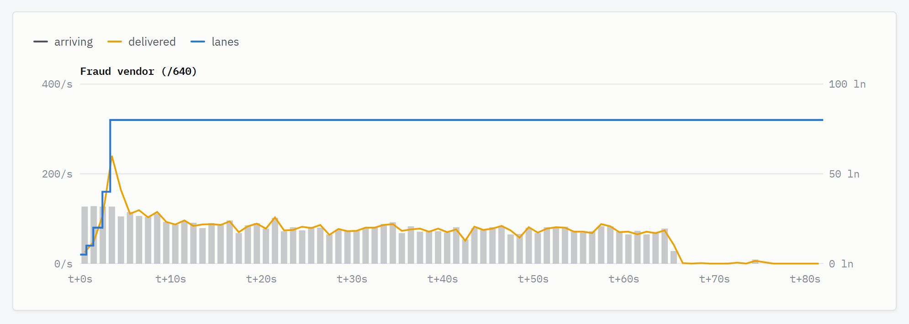
*Run 60, 200 events/s: the fraud vendor doubles 5 → 80 lanes by t+3.3 s, then delivers exactly what arrives.*

and aside from the rejected requests at resize, it performs ok at the high rate as well:

- 666,302 deliveries from 300,000 events in 100 s; analytics received 299,945 of 300,000
- 538 refused: 483 at the fraud vendor during its seven lane resizes in the first 6 seconds, 9 at analytics' first resize, and 46 at analytics when the whole process stalled for ~150 ms at t+33 s and the delayed events then arrived at once
- after the lanes finished growing: p99 first attempt 0.89 s for everything except the ERPs, 0 ordering violations across 243,227 pairs
- 30 dead-lettered, all shared-hosting deliveries after six random 500s

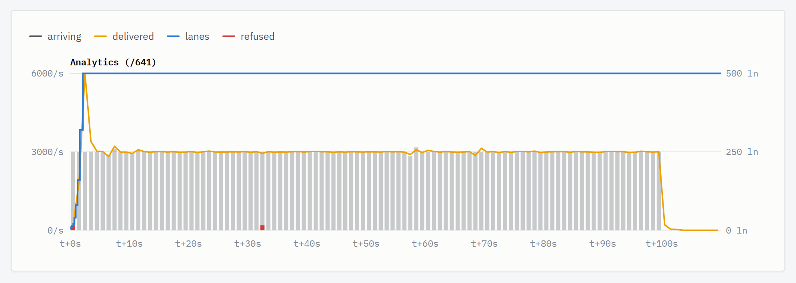
*Run 61: analytics doubles 5 → 500 lanes by t+2.2 s and keeps pace with 3,000 deliveries a second. Red marks: 9 refused at its first resize, 46 after the stall at t+33 s.*

for cpu:

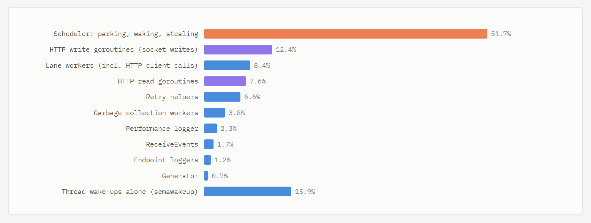
*Run 60, CPU profile at 200 events/s (0.51 of a core): half the CPU is the Go scheduler parking and waking goroutines, because at a slow rate almost every event wakes a sleeping goroutine. At 1,200 events/s (run 56) the scheduler's share was a third, and at 3,000 events/s (run 61, 1.35 cores) 37%; the retry map scans and locks stay under 2%.*


## how to run

Requires Go 1.27 and Python 3 (for the trace generator).

1. Generate the busiest-day trace (the normal-day trace, `events_15000_200ps.csv`, is already included):

   ```
   cd tracegen
   python tracegen.py A=600 B=40 E=300 F=200 events=300000 rate=3000
   ```

2. Start the test receiver (listens on `:8080`). Restart it before every run: its outage schedule for endpoint `/0` starts at the first delivery it receives.

   ```
   cd webhook_receiver
   go run .
   ```

3. In a second terminal, start the delivery system:

   ```
   cd webhook_delivery_system
   go run .
   ```

   It replays the trace named in `generator.go` (`events_300000_3000ps.csv` by default; switch to `events_15000_200ps.csv` for the normal day), drains when the trace ends, and writes four CSV logs (`performance`, `refusals`, `endpointsnap`, `goroutinecount`) into `webhook_delivery_system/`. A busiest-day run takes about 20 minutes, mostly the ERP backlog draining.

4. Optional, while it runs: a 30-second CPU profile.

   ```
   curl -o cpu.pprof "http://localhost:6060/debug/pprof/profile?seconds=30"
   go tool pprof -top cpu.pprof
   ```

## up next for me

- advanced logging: slog/prometheus
- persistence to a database
- production hardening
